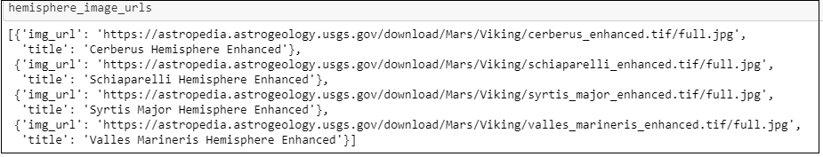
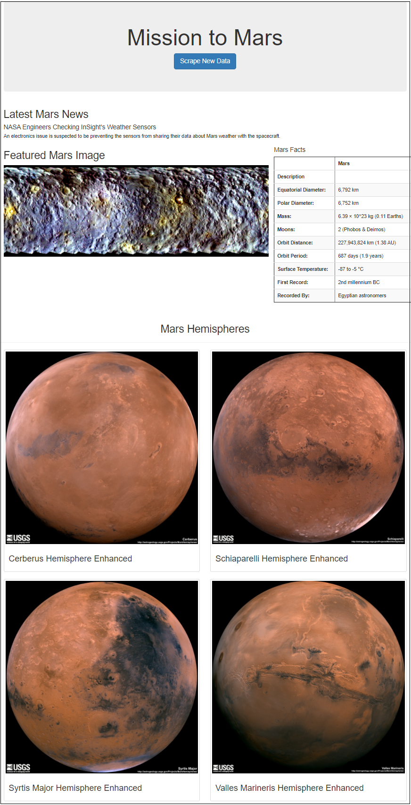

# Mission to Mars


## Results

### Deliverable 1

**Image 1 (below): Hemisphere URLs and Titles as a Python list of dictionaries**



### Deliverable 2

**Image 1 (below): Flask site with the images of Mars Hemispheres**



### Deliverable 3a

**Image 1 (below): Flask site changed to a responsive one**


### Deliverable 3b

Adding two other Bootstrap 3 components
1. Styled the "Scrape New Data" button.
    ``` 
    <p><a class="btn btn-success btn-lg" href="/scrape" role="button">Scrape New Data</a></p>
    ```

2. Added code to have the 4 images side by side
    ```
    <div class="col-md-3">
    ```

**Image 1 (below): Flask site changed to a responsive one**

